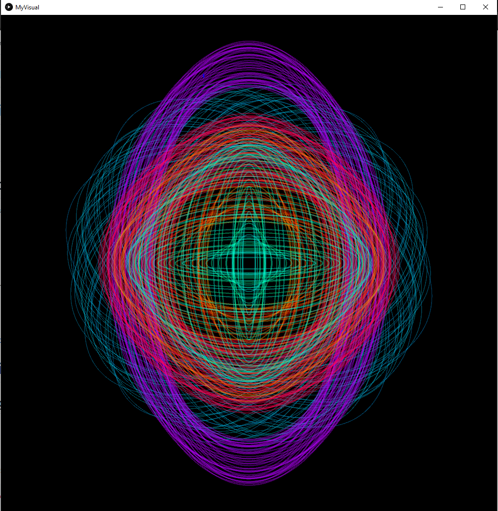
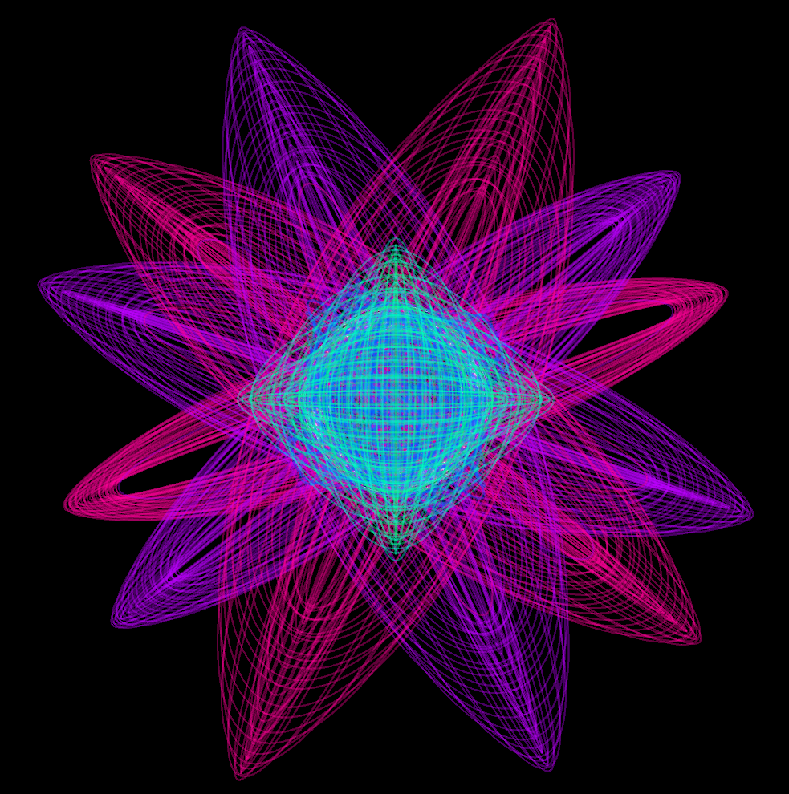
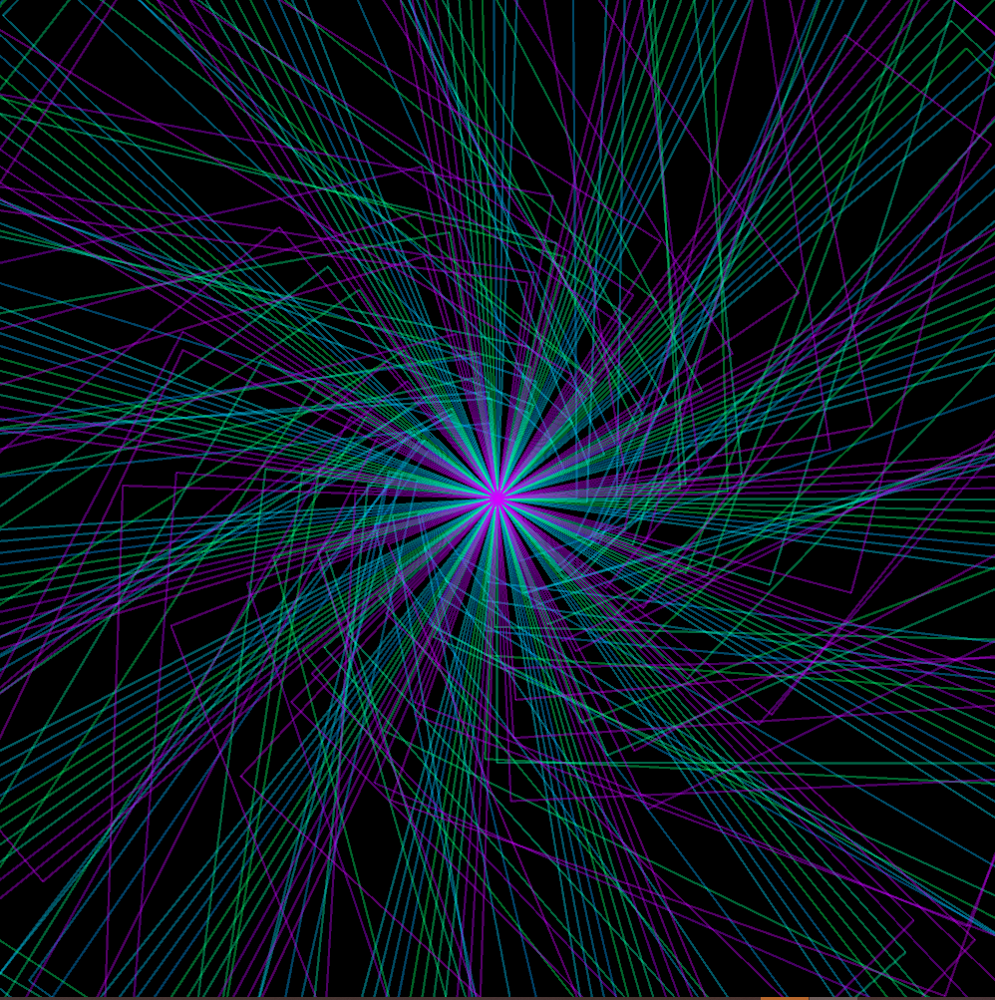
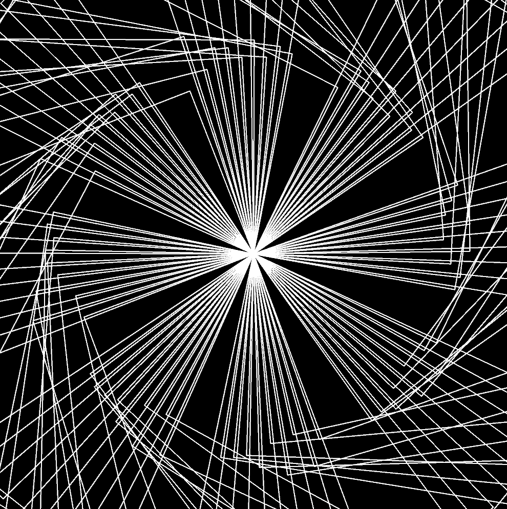
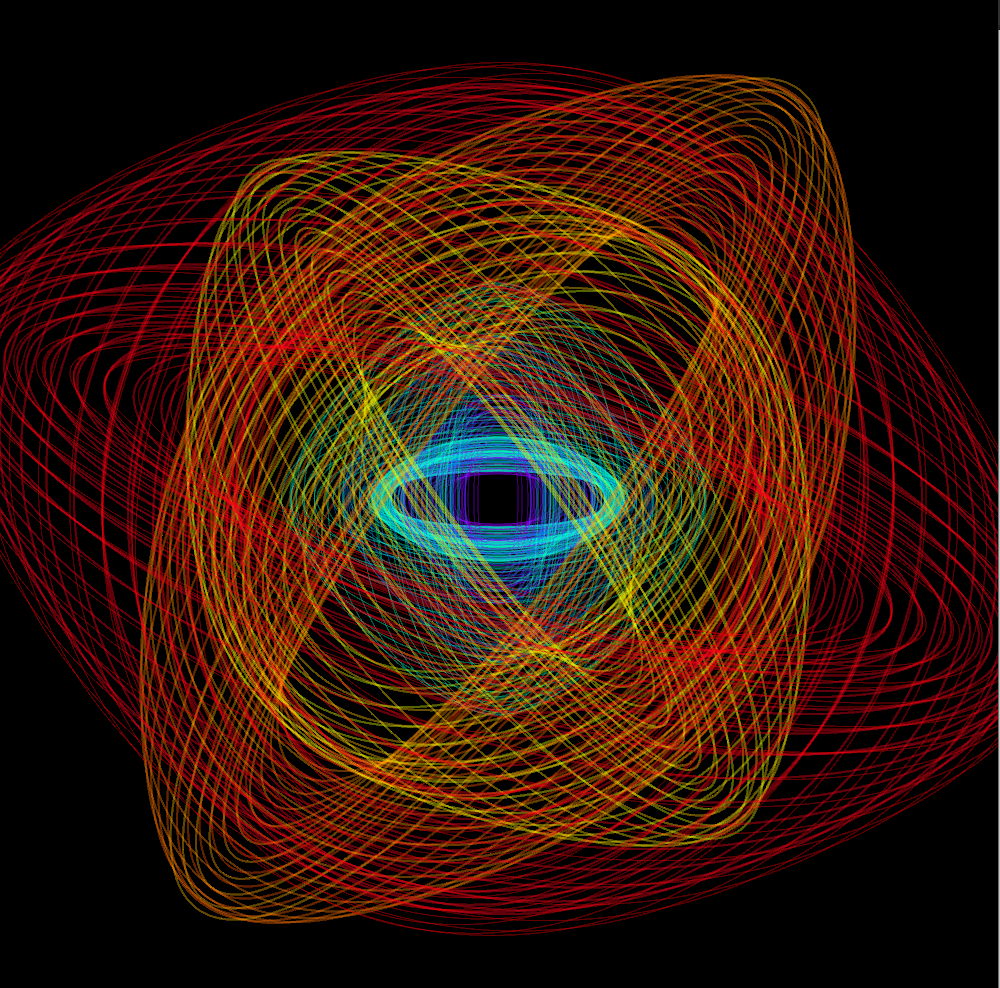
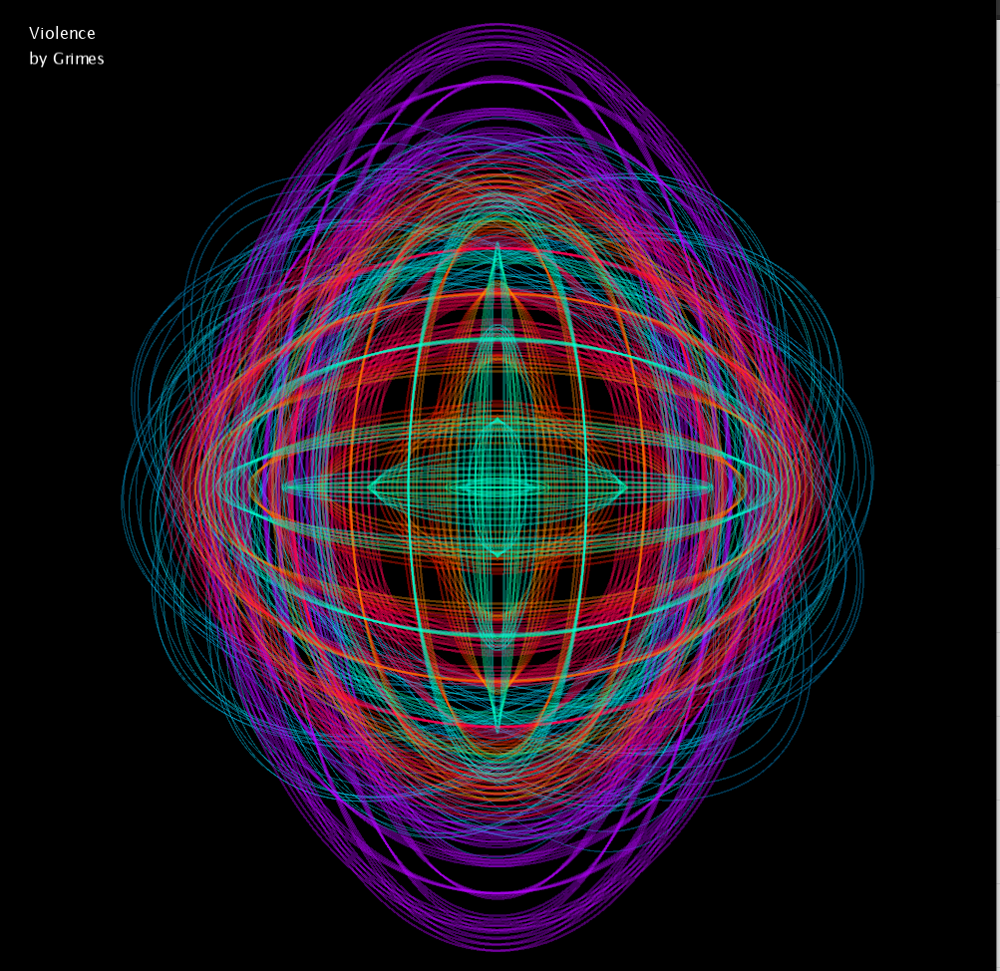
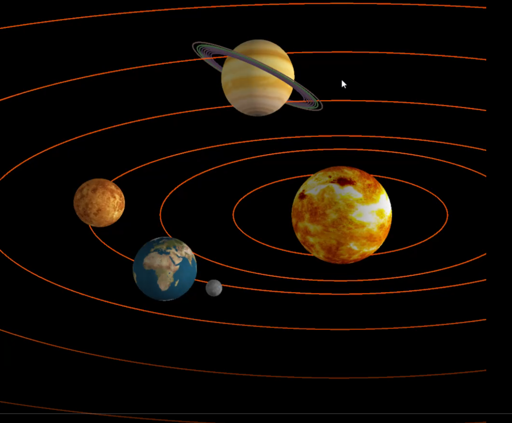

# Music Visualiser Project

Name: Jade Higgins

Student Number: C19365731

# ****** YOUTUBE VIDEO ISSUE ********:
The Youtube video isnt capturing the high quality of the screen capture, However I still included the video in my submission.
I have provided a series of screenshots to compensate.

## My Youtube Video:
[](https://www.youtube.com/watch?v=w5bordtpSVM)

## Instructions
- Fork this repository and use it a starter project for your assignment
- Create a new package named your student number and put all your code in this package.
- You should start by creating a subclass of ie.tudublin.Visual
- There is an example visualiser called MyVisual in the example package
- Check out the WaveForm and AudioBandsVisual for examples of how to call the Processing functions from other classes that are not subclasses of PApplet

# Description of the assignment
This assignment features 6 music visualizers which are all interactively moving 
along to the song *Violence by GRIMES*

The Assignment uses Object Oriented Programming techniques & Principles in Java as well as the Processing Language and the minim library within the Processing Language.

## Visualizer 1: - EllipseWaveform 




## Visualizer 2: - Flower



## Visualizer 3: - Rotating Spiral


## Visualizer 4: - Shooting Star One



## Visualizer 5: - Shooting Star Two



## Visualizer 6: - Interactive Hoops



# Instructions

### How to start the Visualizer:

- Once the repository has been forked and cloned to a directory, open up Visual Studio Code.

- Press F5 or click on the *run* button at the top right corner of the window.

- The Visualizer window will open up.

- Press the *Space Bar* to play the music and start up the music visuals!

### There are 6 Visualizers and they are activated by pressing specific keys such as:

1. Option 0 (default option) displays the EllipseWaveForm Visual 

1. Option 1 displays the Flower Visual

1. Option 2 displays the Rotating Spiral Visual

1. Option 3 displays the Shooting Stars Visuals - Press the *UP Arrow Key* to change between the Visuals

1. Option 4 displays the Interactive Hoops Visual - Move the mouse *Horizontally* across the screen to control and change the size of the *hoop* 


# How it works

#### The assignment has been programmed using *Object Oriented* principles such as: 
- Polymorphism 
- Inheritence
- Abstract Classes and Methods  
- Encapsulation
- etc.

The "main" class - *MyVisual*  calls the built processing methods such as 

```Java
public void draw()
{
	
}//end draw method
```

```Java
public void settings()
{
	
}//end draw method
```

```Java
public void setup()
{
	
}//end draw method
```
In the draw() method, A switch case is used to called the various methods from other classes using instantied objects which were created in the 
setup() method.

#### For Example:

```Java

ShootingStar ss; //reference to the ShootingStar Class
int option=0;

public void setup()
{
	ss = new ShootingStar(this);
	
}//end draw method

public void draw()
{
	switch(option){

		case 1:{

			//calling the method from the ShootingStar class
			ss.render();
			
		}//end case1

	}//end switch
	
}//end draw method
```

### The MyVisual Class also uses Abstract Methods and Classes for Code Reusability

#### Example of Abstract Class

All classes that extend to GameObject will have access to these variables.

```Java
public abstract class GameObject {

    MyVisual mv;
    float x;
    float y;
    float speed = 5;
    float rotation = 0;
    float w =50;
    float halfWidth = w/2;
    float dx, dy;
    int which =0;
    float lastX, lastY;

}// end abstract class
```
#### Example of Abstract Method

This means that any class that extends GameObject *must* include the render() method.

```Java
public abstract void render();
```

# What I am most proud of in the assignment

To be honest, I am most proud of *all* the visuals I have created specifically the first visual - *EllipseWaveForm*
I created this visual by accidently altering with one of the in class examples and by changing the function from 
line() to ellipse() and configuring the rotation, the radius, x & y co-ordinates and the colours! I was able to form this
creation:


This Visual & the chosen song I used - *Violence* inspired the rest of my project and I tried to establish space-like visuals
or something along the lines of that theme. My initial idea for the assignment was to create planets inside of a solar system 
which would rotate to the music. However, I was not pleased with the execution.

#### Example of first design:



Anyway, I enjoyed this assignment and learned alot of OOP principles & The Processing Language. Although it was frustrating at
times and after changing my ideas/song choices over and over again 
I can happily say that I can be satisfied with the outcome!


